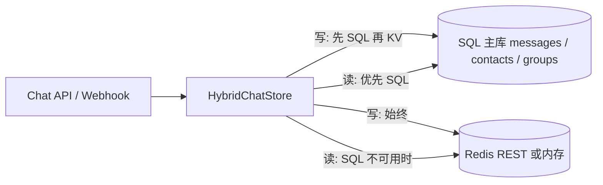

# 部署与运行环境

## 推荐主路径（单人 / 默认可维护路径）

| 场景 | 建议 |
|------|------|
| **Vercel / Serverless 生产** | **libSQL（如 Turso）**：`LIBSQL_URL` + `LIBSQL_AUTH_TOKEN`；**Upstash Redis** 作 KV；可选 `WEBHOOK_FLOW_ASYNC` + Cron 调 worker |
| **本机 / Docker** | **Node 22.5+** + `DATABASE_ENGINE=nodejs-sqlite` 与 `SQLITE_PATH`；或 `file:` libSQL |

**MySQL**（`DATABASE_ENGINE=mysql`）保留为次要路径，需单独维护 `migrations/mysql/`，与默认 `migrations/*.sql` 链路等价物需自建对照。

## 上线安全核对清单

- [ ] **`NEXTAUTH_SECRET`**：强随机，生产必填。  
- [ ] **`INSTALL_SECRET`**：生产下安装变更 API 必填（头 `x-install-secret`）。  
- [ ] **`FLOW_WORKER_SECRET`**：若启用 `WEBHOOK_FLOW_ASYNC`，生产必填；`POST /api/internal/flow-queue/worker` 须带 `x-flow-worker-secret`。  
- [ ] **`CRON_TICK_SECRET`**：若使用控制台「定时任务」，生产必填；由 **Cron / QStash** 定期 `POST /api/internal/cron/tick`，请求头 **`x-cron-tick-secret`** 与之相同。未配置时生产环境该路由会拒绝执行（开发环境可不配 secret）。  
- [ ] **`/api/dev/*`**：生产已由路由挡板禁止危险接口；开发环境若设 **`DEV_DANGEROUS_API_SECRET`**，访问 `/api/dev/init-rbac` 等须带头 **`x-dev-dangerous-secret`**。

## 控制台多语言（next-intl）

- **路由**：页面路径为 **`/{locale}/...`**（当前 **`zh-CN`**、**`en`**，`localePrefix: always`）；访问 **`/`** 由 **`src/proxy.ts`** 中的 next-intl 中间件与 Cookie / `Accept-Language` 协商后重定向。  
- **文案**：`src/messages/<locale>.json`。站内导航请使用 **`@/i18n/navigation`** 的 **`Link` / `useRouter` / `usePathname`**；服务端重定向使用 **`localizedRedirect()`**（`src/i18n/server-redirect.ts`，内部 `getLocale()` + next-intl `redirect`）。  
- **API**：标准错误体 `jsonApiError` 的 `message` 随 Cookie **`NEXT_LOCALE`**（next-intl 语言切换时写入）在 **`apiRequireAuth` / `apiRequirePermission`** 中选文案；中间件对未登录的 **`/api/*`** 亦使用同一套 **`pickMessage`**。  
- **扩展语言**：在 **`src/i18n/routing.ts`** 的 **`locales`** 增加语言代码，新增 **`src/messages/<locale>.json`**，并保证 **`src/app/[locale]/layout.tsx`** 的 **`generateStaticParams`** 仍返回全部 locale。

---

应用核心是 **Next.js App Router**，与具体云平台解耦。数据分为两层：

| 层级 | 技术 | 用途 |
|------|------|------|
| **主库（SQL）** | **可选引擎**（见下） | 用户、RBAC、Flow/Job/Trigger、Bot 配置、聊天落库等 |
| **缓存（可选）** | **Redis over HTTP**（`@upstash/redis`，Upstash 兼容 REST） | 聊天列表缓存、联系人/群列表缓存、Webhook 事件日志 |

---

## 首次安装（`/install`）与版本升级（`/upgrade`）

1. **门禁**：`src/proxy.ts` 根据 **`GET /api/install/status`** 的 **`phase`** 分流（旧名 `middleware` 已弃用）：
   - **`no_database` / `needs_install`** → 重定向到 **`/install`**（首次：配库、可选同步 Vercel、一键建表 + RBAC）。
   - **`needs_upgrade`** → 重定向到 **`/upgrade`**（实例已在跑，仅磁盘上 **`migrations/*.sql`** 有未应用版本时）。
   - **`installed`** → 正常应用；Webhook、Auth、安装 API 等白名单路径不受挡。
2. **`/install`**：填写 **libSQL（Turso）** 或 **本地 `node:sqlite` 路径**，生成 `NEXTAUTH_*` / 可选 Redis；可复制环境变量到托管控制台。  
3. **Vercel**：可填写 Personal Token + Project ID，使用「同步环境变量到 Vercel」后 **必须重新部署**，再执行「数据库一键安装」。  
4. **`/install` 与 `/upgrade`** 均通过 **`POST /api/install/complete`** 执行迁移 + RBAC 校验；会对 **`migrations/*.sql`**（不含 `mysql/`）按文件名顺序应用：**已记录在表 `schema_migrations` 的版本会跳过**；遇非预期错误则中止。`GET /api/install/status` 返回 **`phase`** 与 **`lastAppliedMigration`**。  
5. **`INSTALL_SECRET`（生产必填）**：`POST /api/install/complete`、`POST /api/install/vercel-env` 在生产环境**必须**配置，且请求头 **`x-install-secret`** 与之相同；开发环境可不配。  
6. **`NEXTAUTH_SECRET`（生产必填）**：用于会话加密；并作为 **安装完成 Cookie（`sb_install_ok`）** 的 HMAC 签名密钥（也可单独设 **`INSTALL_COOKIE_SECRET`**）。勿使用可猜值。  
7. **GitHub 注册**：默认 **`GITHUB_SIGNUP` 未设或 `open`** 时允许新用户通过 GitHub 入库；若设 **`GITHUB_SIGNUP=existing_only`** 则仅允许已在 `users` 表内的账号。  
8. **账号即时停用**：JWT 会按 **`SESSION_USER_CHECK_INTERVAL_MS`**（默认 120s）复查 `is_active` 与角色；停用后短时内会话失效。  
9. **新手引导（枢纽 + 分板块）**（结构见 **`migrations/001_initial.sql`** / **`migrations/mysql/001_initial.sql`**）  
   - **`users.onboarding_completed_at`**：表示 **枢纽/首次入门已处理**（完成枢纽或明确跳过入门后由 **`POST /api/onboarding/complete`** 写入）。  
   - **`users.onboarding_sections_json`**：存各板块 `done` / `skipped` 等进度；**不**参与控制台强制重定向。  
   - **门禁**：`src/lib/onboarding/onboarding-gate.ts` 仅看 `onboarding_completed_at`；具备 `roles:create` / `bots:create` / `flows:create` / `agents:manage` 之一且该列为空时，访问 **`(dashboard)`** 会进 **`/onboarding`** 枢纽。板块进度由 **`GET` / `PATCH /api/onboarding/progress`** 维护。  
---

## 主库（SQL）— 三种后端

由 `src/lib/database/db.ts` 根据环境变量选择实现（应用侧请通过 `src/lib/data-layer` 统一访问），方言由 `DATABASE_ENGINE` 或隐式规则决定。

### 1. libSQL（Turso / 自建 sqld / `file:`）

- `LIBSQL_URL`  
- 非 `file:` 时：`LIBSQL_AUTH_TOKEN`  
- 本地文件示例：`file:./relative/path.db`（可不配 token）

### 2. 本地 SQLite（Node.js 自带 `node:sqlite`）

- 需 **Node.js ≥ 22.5**（仓库 `package.json` 中 `engines.node`）
- 推荐显式：`DATABASE_ENGINE=nodejs-sqlite`
- 路径：仅 **`SQLITE_PATH`**（可写 `file:./data.db`，会去掉 `file:` 前缀）
- **不要**同时配置可用的 `LIBSQL_URL`，否则推断会走 libsql（见下「优先级」）

### 3. MySQL 8.x（可选，非默认）

- **必须**同时设置：`DATABASE_ENGINE=mysql`（不会仅因 `MYSQL_DATABASE` 自动启用）
- `MYSQL_USER`、`**MYSQL_DATABASE**` 必填；`MYSQL_HOST`（默认 `127.0.0.1`）、`MYSQL_PORT`（默认 `3306`）、`MYSQL_PASSWORD` 可选  
- 首次建表：执行 `migrations/mysql/001_initial.sql`（先 `CREATE DATABASE ... utf8mb4`）  
- 业务假定迁移已含 `owner_id` 等列，**不会像 SQLite 那样在运行时自动补列**

### 优先级（未设置 `DATABASE_ENGINE` 时）

1. 若配置了 `SQLITE_PATH` **且未**配置 `LIBSQL_URL` → **node:sqlite**  
2. 否则 → **libsql**（依赖 URL/token，见 `resolvePrimarySqlConfig`）  
3. **MySQL** 仅在显式 `DATABASE_ENGINE=mysql` 且配好 `MYSQL_USER` / `MYSQL_DATABASE` 时启用（默认部署以 SQLite / libSQL 为主）

未配置任一可用主库时：读查询多返回空、写入不落库（仅适合无面板调试）。

SQLite 增量迁移在 `migrations/*.sql`；MySQL 使用 `migrations/mysql/` 下脚本。另有 `src/lib/database/ensure-owner-schema.ts` 仅用于 **libsql / node:sqlite** 旧库补列。

---

## 缓存（Redis REST）

聊天与日志使用 **Upstash 定义的 HTTP API**，依赖 **`@upstash/redis`**（不再依赖 `@vercel/kv`）。

- 在 [Upstash Console](https://console.upstash.com) 创建 Redis，仅此一组变量：**`UPSTASH_REDIS_REST_URL`**、**`UPSTASH_REDIS_REST_TOKEN`**。

未配置二者或 **`KV_BACKEND=memory`**：使用**进程内内存**缓存（重启丢失）。

### ChatStore（Hybrid）：SQL 与 KV 谁主谁备

控制台聊天、联系人、群列表由 `getChatStore()` 返回的 **`HybridChatStore`**（`src/lib/persistence/chat-store.ts`）读写：

- **写路径**：若已配置关系库，**先尽量写 SQL**，再写 KV。SQL 失败时打 **结构化日志**（`event: hybrid_chat_sql_failure`）。若设置 **`CHAT_SQL_REQUIRED=1`**（或 `true`），SQL 写失败将 **抛出错误且不再写 KV**，避免「面板与主库」静默分叉。
- **读路径**：若 SQL 可用，**优先从 SQL 读**；SQL 未配置或读失败则**回落到 KV**（失败同样记录结构化日志）。

因此：**持久真相以 SQL 为准（在已配置且写入成功时）**；KV 为**加速 / 会话级缓存**（TTL 见实现，如联系人列表约 30 分钟）。未配 SQL 时，仅剩 KV/内存，重启可能丢数据。



---

## Serverless 超时与异步执行

Flow、LLM、外向 HTTP 等在 **Vercel Functions** 上受单次请求**最大执行时间**限制（计划与区域不同，常见默认约 **10s～60s**，需在控制台或计划中确认）。长时间工作易 **504 / 被平台切断**。

**已实现（仓库内）：**

1. **`WEBHOOK_MAX_DURATION_SEC`**（默认 `60`，上限 `300`）：[`/api/webhook/...`](../../src/app/api/webhook/[platform]/[bot_id]/route.ts) 与 [`/api/chat/send`](../../src/app/api/chat/send/route.ts) 的 **`maxDuration`**。
2. **`FLOW_PROCESS_BUDGET_MS`**：非 0 时，`FlowProcessor` 在步骤前与 `delay` 步骤中 respect **软截止**（超时则停止后续步骤并记录原因）。
3. **异步入队**：设置 **`WEBHOOK_FLOW_ASYNC=1`**（或 `true`）后，Webhook 在校验与解析成功后 **将事件 JSON 推入 Redis/内存列表**（键 `flow:webhook:queue`）。默认在入队前对 `event.id` 做 **NX 去重**（**`WEBHOOK_FLOW_DEDUPE_TTL_SEC`**，默认 86400s）。若设 **`WEBHOOK_FLOW_DEDUPE_ON_SUCCESS_ONLY=1`**，则**入队前不去重**，仅在 **Flow 成功结束后** 写入去重键，便于 IM 侧用同一 `event.id` 对失败投递重试（可能与并发重复入队并存，由业务权衡）。  
   需由 **Cron / QStash** 等定期请求：  
   - **`POST /api/internal/flow-queue/worker`**（处理主队列 + 将到期延时重试并入队）  
   - 请求头：**`x-flow-worker-secret: <FLOW_WORKER_SECRET>`**（生产 **必填**）。  
   - 常用环境变量：**`FLOW_WORKER_BATCH`**（默认 8）、**`FLOW_WORKER_MAX_DURATION_SEC`**（默认 300）、**`FLOW_WORKER_MAX_ATTEMPTS`**（默认 3，超过进 DLQ）、**`FLOW_WORKER_RETRY_DELAY_MS`**（默认 0；大于 0 时使用 sorted set `flow:webhook:retry_z` 延时再次进入主队列）、**`FLOW_WORKER_DLQ_MAX`**（死信列表 `flow:webhook:dlq` 截断长度，默认 2000）、**`WEBHOOK_FLOW_QUEUE_MAX`**（主队列上限，默认 5000）。  
   Worker 返回 JSON 含 **`promotedRetries`**、**`retried`**、**`dlqPushed`**；每次出队的异步任务会打结构化日志 **`event: flow_worker_job`**（`outcome`: `ok` | `retry` | `dlq` | `skip`）。
4. **观测（不返回队列明文）**：**`GET /api/internal/flow-queue/status`**，请求头同样带 **`x-flow-worker-secret`**，响应 **`queueLen` / `dlqLen` / `retryDueCount` / `retryScheduledTotal` / `kvBackend`**。可接监控告警（例如 **`queueLen` 长时间高于阈值**、**`dlqLen` 持续增长**）。
5. 仍可通过 **[Upstash QStash](https://upstash.com/docs/qstash)** 等对 worker URL 做重试与观测。

### Flow 异步队列运维

- **Cron 频率**：建议 **≤ 主队列平均滞留时间**（例如每秒或每 5～15 秒一次，视流量调整）；延时重试依赖 worker 拉取到期项，频率过低会拉长重试延迟。  
- **DLQ 处置**：在 Upstash Console 对 key **`flow:webhook:dlq`** 做 `LRANGE` 查看 JSON 条目（**`kind: corrupt`** 为无法解析的原始行；**`kind: failed`** 为处理失败）；确认后可 **`DEL`** 或按需写脚本回放（回放需自行防重）。  
- **秘钥轮换**：更新 **`FLOW_WORKER_SECRET`** 后，同步修改 Cron/QStash 请求头；旧 secret 立即失效。  
- **已知限制**：消费采用 **`lpop`**，若在 **取出后、执行完前** 进程被平台强杀，**极少数情况会丢单**。缓解：控制 **`FLOW_WORKER_BATCH`**、用 QStash 对 worker **HTTP 重试**、或后续自研 **RPOPLPUSH + lease 回收**（需扩展 Redis 命令与回收路由）。

自建 Docker / 长驻 Node 时一般无平台级 `maxDuration`，但仍需注意反向代理超时。

### 定时任务（Job 步骤驱动）

控制台 **「定时任务」** 将 **Cron 表达式** 与已有 **步骤流水线（Job）+ 机器人（Bot）** 绑定；到期时由内部路由 **`POST /api/internal/cron/tick`** 扫描到期项并调用与 Webhook 相同的 **`FlowProcessor` / 步骤执行器**（合成 `notice` 事件上下文，可在步骤里用变量如 `scheduledTaskId`、`cronFiredAt`）。

- **环境变量**：**`CRON_TICK_SECRET`**（生产必填）；请求头 **`x-cron-tick-secret`**。  
- **`maxDuration`**：tick 路由与 flow worker 类似建议使用较长上限（仓库内已设 `300`）。  
- **幂等与重试**：仅当 Job **整链成功** 后更新 `last_run_at`；失败则下次 tick 可再次尝试。  
- **执行记录**：完整初始化脚本已包含表 **`scheduled_task_runs`**；每次 tick 会写入开始/结束时间与 **`ok` / `error`** 及错误摘要，详情页可拉取 **`GET /api/scheduled-tasks/:id/runs`**。若库里 **缺少该表**（极旧库），接口会返回 **`200`**、**`runs: []`**、**`degraded: true`**（**`reason: scheduled_task_runs_missing`**），便于与真实 500 区分。  
- **Vercel Cron 示例**：在 `vercel.json` 增加对 `https://<部署域名>/api/internal/cron/tick` 的定时 `POST`，并在 **Environment Variables** 中配置 `CRON_TICK_SECRET`，Cron 请求的 Headers 需附带 `x-cron-tick-secret`（若平台不支持自定义 Header，需改用 **QStash** 等可带头部的调度）。

---

## 运行形态

| 环境 | 说明 |
|------|------|
| **任意 Serverless / Edge** | 只要支持 Node 或 Edge + 出站 HTTPS，能连主库与可选 Redis REST 即可。 |
| **Docker / VPS** | 使用仓库 `Dockerfile`（`output: 'standalone'`）；配齐 SQL + 可选 Redis REST。 |
| **Railway / Fly.io / Render** | 与 Docker 类似，注入环境变量；`PORT`、`HOSTNAME=0.0.0.0` 已在 Dockerfile 中示例。 |

---

## 对外 URL

**`NEXTAUTH_URL`**：公网根地址（无末尾斜杠）；代码里 `getPublicAppUrl()` 只读此变量。

另见 `getRuntimeSummary()`（`src/lib/runtime/runtime.ts`）。其中 `getRuntimeSummary().sql` 使用 `isRelationalDatabaseConfigured()`，覆盖 libsql / node:sqlite / MySQL。

---

## Docker 示例

```bash
docker build -t serverless-bot .
docker run --rm -p 3000:3000 \
  -e NEXTAUTH_URL=https://your.domain \
  -e NEXTAUTH_SECRET=... \
  -e LIBSQL_URL=file:/data/app.db \
  -e UPSTASH_REDIS_REST_URL=... \
  -e UPSTASH_REDIS_REST_TOKEN=... \
  serverless-bot
```

本地 **node:sqlite** 示例：挂载数据目录并设置 `DATABASE_ENGINE=nodejs-sqlite`、`SQLITE_PATH=/data/app.db`。  
远端 **MySQL**：设置 `DATABASE_ENGINE=mysql` 与 `MYSQL_*`，且不在该容器内依赖 `LIBSQL_URL`。
